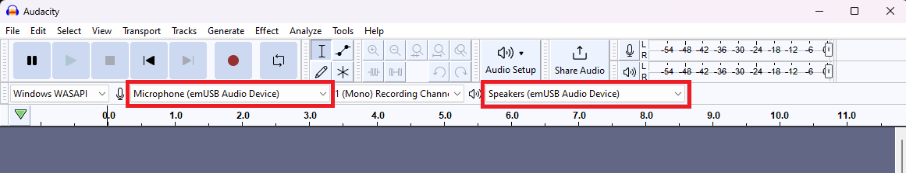

# emUSB-Device: Audio device

This example demonstrates how to setup the USB block of an Infineon MCU using Segger's emUSB-device middleware to implement a USB audio device and HID audio playback control which then connects to the PC via the USB interface. The example uses FreeRTOS.

This code example shows how to use the Infineon MCU to enumerate a standard USB audio device and HID consumer control over the USB interface. The PC host sees the device as:
- Audio playback device
- Microphone/recording device
- Remote control handling volume, play/pause/stop

The Infineon MCU device works as a bridge between the audio data streamed from the USB host and the I2S block, which connects to an audio codec. The audio codec outputs the audio data to a speaker or headphones. The same audio codec can input microphone data and stream to the Infineon MCU device, which bridges to the USB interface.

CAPSENSE&trade; buttons are used to play/pause/stop and change the volume of the data streamed to the Infineon MCU device. Any press of CAPSENSE&trade; buttons is reported back to the host over USB HID consumer control.

**Figure 1. Block diagram**


[View this README on GitHub.](https://github.com/Infineon/mtb-example-usb-device-audio-freertos)

[Provide feedback on this code example.](https://cypress.co1.qualtrics.com/jfe/form/SV_1NTns53sK2yiljn?Q_EED=eyJVbmlxdWUgRG9jIElkIjoiQ0UyMzcxMDAiLCJTcGVjIE51bWJlciI6IjAwMi0zNzEwMCIsIkRvYyBUaXRsZSI6ImVtVVNCLURldmljZTogQXVkaW8gZGV2aWNlIiwicmlkIjoicGFsYW5pc3dhbXkiLCJEb2MgdmVyc2lvbiI6IjEuMC4wIiwiRG9jIExhbmd1YWdlIjoiRW5nbGlzaCIsIkRvYyBEaXZpc2lvbiI6Ik1DRCIsIkRvYyBCVSI6IklDVyIsIkRvYyBGYW1pbHkiOiJQU09DIn0=)

## Requirements

- [ModusToolbox&trade; software](https://www.infineon.com/modustoolbox) v3.0 or later (tested with v3.0)
- Board support package (BSP) minimum required version: 4.0.0
- Programming language: C
- Associated parts: All [PSoC&trade; 6 MCU](https://www.infineon.com/cms/en/product/microcontroller/32-bit-psoc-arm-cortex-microcontroller/psoc-6-32-bit-arm-cortex-m4-mcu) parts


## Supported toolchains (make variable 'TOOLCHAIN')

- GNU Arm&reg; embedded compiler v10.3.1 (`GCC_ARM`) - Default value of `TOOLCHAIN`
- Arm&reg; compiler v6.16 (`ARM`)
- IAR C/C++ compiler v9.30.1 (`IAR`)

## Supported kits (make variable 'TARGET')

- [PSoC&trade; 6 Wi-Fi Bluetooth&reg; Pioneer Kit](https://www.infineon.com/CY8CKIT-062-WiFi-BT) (`CY8CKIT-062-WIFI-BT`) – Default value of `TARGET`
- [PSoC&trade; 62S2 Wi-Fi Bluetooth&reg; Pioneer Kit](https://www.infineon.com/CY8CKIT-062S2-43012) (`CY8CKIT-062S2-43012`)
- [PSoC&trade; 62S1 Wi-Fi Bluetooth&reg; Pioneer Kit](https://www.infineon.com/CYW9P62S1-43438EVB-01) (`CYW9P62S1-43438EVB-01`)
- [PSoC&trade; 62S1 Wi-Fi Bluetooth&reg; Pioneer Kit](https://www.infineon.com/CYW9P62S1-43012EVB-01) (`CYW9P62S1-43012EVB-01`)
- [PSoC&trade; 62S2 Evaluation Kit](https://www.infineon.com/CY8CEVAL-062S2) (`CY8CEVAL-062S2`, `CY8CEVAL-062S2-LAI-4373M2`, `CY8CEVAL-062S2-MUR-43439M2`, `CY8CEVAL-062S2-LAI-43439M2`)


## Hardware setup

This code example requires an external analog microphone/speaker headset connected to the AK4954A audio codec. You must connect the CY8CKIT-028-TFT shield to the Arduino header if you are using any of the pioneer kits.

**Note:** The PSoC&trade; 6 Bluetooth&reg; LE Pioneer Kit (CY8CKIT-062-BLE) and the PSoC&trade; 6 Wi-Fi Bluetooth&reg; Pioneer Kit (CY8CKIT-062-WIFI-BT) ship with KitProg2 installed. The ModusToolbox&trade; software requires KitProg3. Before using this code example, make sure that the board is upgraded to KitProg3. The tool and instructions are available in the [Firmware Loader](https://github.com/Infineon/Firmware-loader) GitHub repository. If you do not upgrade, you will see an error like "unable to find CMSIS-DAP device" or "KitProg firmware is out of date".


## Software setup

This example uses the [Audacity](https://www.audacityteam.org/) tool to record and play sound. You can also use any software tool that plays music.

## Using the code example

Create the project and open it using one of the following:

<details><summary><b>In Eclipse IDE for ModusToolbox&trade; software</b></summary>

1. Click the **New Application** link in the **Quick Panel** (or, use **File** > **New** > **ModusToolbox&trade; Application**). This launches the [Project Creator](https://www.infineon.com/ModusToolboxProjectCreator) tool.

2. Pick a kit supported by the code example from the list shown in the **Project Creator - Choose Board Support Package (BSP)** dialog.
   When you select a supported kit, the example is reconfigured automatically to work with the kit. To work with a different supported kit later, use the [Library Manager](https://www.infineon.com/ModusToolboxLibraryManager) to choose the BSP for the supported kit. You can use the Library Manager to select or update the BSP and firmware libraries used in this application. To access the Library Manager, click the link from the **Quick Panel**.

   You can also just start the application creation process again and select a different kit.

   If you want to use the application for a kit not listed here, you may need to update the source files. If the kit does not have the required resources, the application may not work.

3. In the **Project Creator - Select Application** dialog, choose the example by enabling the checkbox.

4. (Optional) Change the suggested **New Application Name**.

5. The **Application(s) Root Path** defaults to the Eclipse workspace which is usually the desired location for the application. If you want to store the application in a different location, you can change the *Application(s) Root Path* value. Applications that share libraries should be in the same root path.

6. Click **Create** to complete the application creation process.

For more details, see the [Eclipse IDE for ModusToolbox&trade; software user guide](https://www.infineon.com/MTBEclipseIDEUserGuide) (locally available at *{ModusToolbox&trade; software install directory}/docs_{version}/mt_ide_user_guide.pdf*).

</details>
<details><summary><b>In command-line interface (CLI)</b></summary>

ModusToolbox&trade; software provides the Project Creator as both a GUI tool and the command line tool, "project-creator-cli". The CLI tool can be used to create applications from a CLI terminal or from within batch files or shell scripts. This tool is available in the *{ModusToolbox&trade; software install directory}/tools_{version}/project-creator/* directory.

Use a CLI terminal to invoke the "project-creator-cli" tool. On Windows, use the command line "modus-shell" program provided in the ModusToolbox&trade; software installation instead of a standard Windows command-line application. This shell provides access to all ModusToolbox&trade; software tools. You can access it by typing `modus-shell` in the search box in the Windows menu. In Linux and macOS, you can use any terminal application.

The "project-creator-cli" tool has the following arguments:

Argument | Description | Required/optional
---------|-------------|-----------
`--board-id` | Defined in the `<id>` field of the [BSP](https://github.com/Infineon?q=bsp-manifest&type=&language=&sort=) manifest | Required
`--app-id`   | Defined in the `<id>` field of the [CE](https://github.com/Infineon?q=ce-manifest&type=&language=&sort=) manifest | Required
`--target-dir`| Specify the directory in which the application is to be created if you prefer not to use the default current working directory | Optional
`--user-app-name`| Specify the name of the application if you prefer to have a name other than the example's default name | Optional

<br />
The following example clones the "[mtb-example-usb-device-audio-freertos](https://github.com/Infineon/mtb-example-usb-device-audio-freertos)" application with the desired name "USBAaudioRecorder" configured for the *CY8CKIT-062-WIFI-BT* BSP into the specified working directory, *C:/mtb_projects*:

   ```
   project-creator-cli --board-id CY8CKIT-062-WIFI-BT --app-id mtb-example-usb-device-audio-freertos --user-app-name USBAudioRecorder --target-dir "C:/mtb_projects"
   ```

**Note:** The project-creator-cli tool uses the `git clone` and `make getlibs` commands to fetch the repository and import the required libraries. For details, see the "Project creator tools" section of the [ModusToolbox&trade; software user guide](https://www.infineon.com/ModusToolboxUserGuide) (locally available at *{ModusToolbox&trade; software install directory}/docs_{version}/mtb_user_guide.pdf*).

To work with a different supported kit later, use the [Library Manager](https://www.infineon.com/ModusToolboxLibraryManager) to choose the BSP for the supported kit. You can invoke the Library Manager GUI tool from the terminal using `make library-manager` command or use the Library Manager CLI tool "library-manager-cli" to change the BSP.

The "library-manager-cli" tool has the following arguments:

Argument | Description | Required/optional
---------|-------------|-----------
`--add-bsp-name` | Name of the BSP that should be added to the application | Required
`--set-active-bsp` | Name of the BSP that should be as active BSP for the application | Required
`--add-bsp-version`| Specify the version of the BSP that should be added to the application if you do not wish to use the latest from manifest | Optional
`--add-bsp-location`| Specify the location of the BSP (local/shared) if you prefer to add the BSP in a shared path | Optional

<br />
Following example adds the CY8CKIT-062-WIFI-BT BSP to the already created application and makes it the active BSP for the app:

   ```
   ~/ModusToolbox/tools_3.0/library-manager/library-manager-cli --project "C:/mtb_projects/USBAudioRecorder" --add-bsp-name CY8CKIT-062-WIFI-BT --add-bsp-version "latest-v4.X" --add-bsp-location "local"

   ~/ModusToolbox/tools_3.0/library-manager/library-manager-cli --project "C:/mtb_projects/USBAudioRecorder" --set-active-bsp APP_CY8CKIT-062-WIFI-BT
   ```

</details>

<details><summary><b>In third-party IDEs</b></summary>

Use one of the following options:

- **Use the standalone [Project Creator](https://www.infineon.com/ModusToolboxProjectCreator) tool:**

   1. Launch Project Creator from the Windows Start menu or from *{ModusToolbox&trade; software install directory}/tools_{version}/project-creator/project-creator.exe*.

   2. In the initial **Choose Board Support Package** screen, select the BSP, and click **Next**.

   3. In the **Select Application** screen, select the appropriate IDE from the **Target IDE** drop-down menu.

   4. Click **Create** and follow the instructions printed in the bottom pane to import or open the exported project in the respective IDE.

<br>

- **Use command-line interface (CLI):**

   1. Follow the instructions from the **In command-line interface (CLI)** section to create the application.

   2. Export the application to a supported IDE using the `make <ide>` command.

   3. Follow the instructions displayed in the terminal to create or import the application as an IDE project.

For a list of supported IDEs and more details, see the "Exporting to IDEs" section of the [ModusToolbox&trade; software user guide](https://www.infineon.com/ModusToolboxUserGuide) (locally available at *{ModusToolbox&trade; software install directory}/docs_{version}/mtb_user_guide.pdf*).

</details>

**Note:** Initially, the customized configuration files such as *design.cyqspi*, *design.cycapsense*, and *design.modus* are present in the *templates/TARGET_< BSP-NAME >/config* folder and are copied automatically from this folder to *bsps/TARGET_< BSP-NAME >/config* during library updates. The build system reads all these configurations from the *bsps/TARGET_< BSP-NAME >/config* folder.

</details>


## Operation

1. Connect the CY8CKIT-028-TFT shield to the Pioneer Kit.

2. Open a terminal program and select the KitProg3 COM port. Set the serial port parameters to 8N1 and 115200 baud.

3. Program the board using one of the following:

   <details><summary><b>Using Eclipse IDE for ModusToolbox&trade; software</b></summary>

      1. Select the application project in the Project Explorer.

      2. In the **Quick Panel**, scroll down, and click **\<Application Name> Program (KitProg3_MiniProg4)**.
   </details>

   <details><summary><b>Using CLI</b></summary>

     From the terminal, execute the `make program` command to build and program the application using the default toolchain to the default target. The default toolchain is specified in the application's Makefile but you can override this value manually:
      ```
      make program TOOLCHAIN=<toolchain>
      ```

      Example:
      ```
      make program TOOLCHAIN=GCC_ARM
      ```
   </details>

        **Note:** Before building the application, ensure that the *deps* folder contains the BSP file (*TARGET_xxx.mtb*) corresponding to the TARGET. Execute the `make getlibs` command to fetch the BSP contents before building the application.  

       After programming, the application starts automatically. 

4. Connect a headphone or earphones to the audio jack of the CY8CKIT-028-TFT shield.

5. Connect another USB cable from your PC (or reuse the same cable used to program the kit) to the USB device connector (see the kit user guide for its location). 

6. On the PC, verify that a new USB device is enumerated as a Speaker/Microphone and named as "4-Audio Control".

7. Use your audio software to specify the microphone or speaker. In the Audacity software tool, select the microphone and speaker name as "4-Audio Control".

   

8. Record some sound. In Audacity, press **Record** . Stop at any time by pressing **Stop** .

9. Press **Play**  to play the record and confirm that the sound is recorded correctly.

10. Open a music player on the PC and play a song. Use the CAPSENSE&trade; slider to change the volume.

    **Note:** You need to set the Speaker "4-Audio Control" as the default speaker device in your OS.

11. Press the left CAPSENSE&trade; button (BTN0) in the kit to play/pause a soundtrack.

12. Press the right CAPSENSE&trade; button (BTN1) in the kit to stop a soundtrack.


## Debugging

You can debug the example to step through the code. In the IDE, use the **\<Application Name> Debug (KitProg3_MiniProg4)** configuration in the **Quick Panel**. For details, see the "Program and debug" section in the [Eclipse IDE for ModusToolbox&trade; software user guide](https://www.infineon.com/MTBEclipseIDEUserGuide).

**Note:** **(Only while debugging)** On the CM4 CPU, some code in `main()` may execute before the debugger halts at the beginning of `main()`. This means that some code executes twice – once before the debugger stops execution, and again after the debugger resets the program counter to the beginning of `main()`. See [KBA231071](https://community.infineon.com/docs/DOC-21143) to learn about this and for the workaround.


## Design and implementation

The [CY8CKIT-028-TFT](https://www.infineon.com/cms/en/product/evaluation-boards/cy8ckit-028-tft/) shield contains the audio codec [AK4954A](https://www.akm.com/content/dam/documents/products/audio/audio-codec/ak4954aen/ak4954aen-en-datasheet.pdf), which is a 32-bit stereo codec with a microphone.

If using AK4594A, the PSoC&trade; 6 MCU device configures the audio codec through the I2C Master (SCB) and streams the audio data through the I2S interface, which operates as Slave (Tx) and Master (Rx). 

The codecs also require a Master clock (MCLK), which is generated by the PSoC&trade; 6 MCU device using a PWM (TCPWM). This clock is set to be 384x the frame rate. In this application, the frame rate can be set to 16 ksps and 22.05 ksps, requiring MCLK of 6.144 MHz and 8.4672 MHz, respectively. See the [limitations](#limitations) section for more details.

Note that the recommended method to generate the MCLK is through the HFCLK4, which allows connecting directly to an external pin. In this case, the PLL can source the HFCLK1 (audio subsystem) and HFCLK4, and any other available clock can drive the HFCLK0 (system clock).


### Firmware details

The firmware implements a bridge between the USB and I2S blocks. The emUSB descriptor implements the audio device class with two endpoints and the HID device class with one endpoint:

- **Audio IN endpoint:** Sends the audio data to the USB host
- **Audio OUT endpoint:** Receives the audio data from the USB host
- **HID audio/playback control endpoint:** Controls the volume and audio play/ pause

The example project firmware uses FreeRTOS on the CM4 CPU. The following tasks are created in the *main.c*:

- **Audio app task:** Implements the high-level functions related to the audio. For example, requests to and volume.

- **Audio IN task:** Implements the functions related to the audio IN Endpoint.

- **Audio OUT task:** Implements the functions related to the audio OUT Endpoint.

- **Touch task:** Implements the user interface related to CAPSENSE&trade;.

- **Idle task:** Goes to sleep.

**Figure 2. Audio OUT and feedback endpoints flow**


**Figure 3. Audio IN endpoint flow**


The Audio IN task waits for a recording request from the USB host. When it receives the request, it prepares I2S Rx to sample a new frame. It initially writes a null frame to the Audio IN Endpoint buffer to initiate the recording. The frame size depends on the sample rate (16 ksps), the number of channels (2x), and the duration of USB transfer (1 ms). The overall equation is:

```
Frame size = Sample rate x Number of channels x Transfer time
```

In this example, the frame size is equal to 16000 x 2 x 0.001 = 32 samples. Note that the Audio IN Endpoint Callback reads all the data available in the I2S Rx FIFO. In ideal conditions, it reads 32 samples, but it might read more or less samples, depending on the clock differences between the PSoC&trade; 6 MCU audio subsystem clock and the Host USB clock. Two additional samples are added on top of the frame size to define the maximum Audio IN and OUT endpoint size.

In the Touch task, the firmware uses the CAPSENSE&trade; resource to scan finger touches on the kit's buttons and slider. The left button (BTN0) plays or pauses a soundtrack and the right button (BTN1) stops a soundtrack. This is achieved by sending a command over the HID Audio/Playback Control endpoint. The CAPSENSE&trade; slider controls the volume. It also sends a command over the HID and configures the volume played in the audio codec.

### Limitations

This code example has the following limitations:

1. The emUSB-device descriptor has provision only to initialize IN and OUT endpoints. A third FEEDBACK endpoint cannot be initialized. The purpose of the FEEDBACK endpoint is to synchronize the clocks between the USB host and the PSoC&trade; 6 MCU audio subsystem in the OUT endpoint flow.

2. The maximum endpoint buffer size combined for all audio endpoints is limited to 192B. This code example supports sample rates of up to 16 ksps and 22.05 ksps because of this limitation.

    **Note:** The clock configurations in the custom BSP provided in the *templates* folder support a 16 ksps sample rate.


**Table 1. Project files**

File  | Description
------|-------
*main.c (CM4)* | Contains the main function, which is the entry point for executing the application. The main function sets up the user tasks and starts the RTOS scheduler. It also implements the Idle task.
*audio_app.c/h* |Contain the task that handles the audio-related blocks, such as the USB audio events and I2S control.
*audio_in.c/h* | Contain the task that handles recording requests to the Audio IN endpoint. These files also implement the Audio IN Data Endpoint callback.
*audio_out.c/h* | Contain the task that handles playing requests to the Audio OUT endpoint. These files also implement the Audio OUT Data endpoint callback.
*audio.h* | Contains macros related to the emUSB-device descriptor.
*cycfg_emusbdev.c/h* | Contain macros and functions related to the USBFS block and USB audio device class.
*touch.c/h* |Handle CAPSENSE&trade; calls.
*ak4954a.c/h* |Implement the driver for the AK4954A audio codec.
*rtos.h* |Contains macros and handles for the FreeRTOS components in the application.
*FreeRTOSConfig.h* |Contains the FreeRTOS settings and configuration. Non-default settings are marked with inline comments. For details of FreeRTOS configuration options, see the [FreeRTOS customization](https://www.freertos.org/a00110.html) webpage.

<br>

### Resources and settings

**Table 2. Application resources**

 Resource         | Alias/object            | Purpose
 :---------       | :---------------------- | :----------
 SCB (I2C) (HAL)  | mi2c          | I2C master driver to configure the audio codec
 TCPWM (PWM) (HAL)| mclk_pwm | PWM to clock the external audio codec
 USBDEV (HAL)     | CYBSP_USBDEV         | USB Device configured with Audio and HID Descriptors
 I2S (HAL)        | CYBSP_I2S | Interface with the audio codec
 CAPSENSE&trade; (PDL) | CYBSP_CSD | Scan for button and slider touches

<br>

## Related resources

Resources  | Links
-----------|----------------------------------
Application notes  | [AN228571](https://www.infineon.com/AN228571) – Getting started with PSoC&trade; 6 MCU on ModusToolbox&trade; software <br />  [AN215656](https://www.infineon.com/AN215656) – PSoC&trade; 6 MCU: Dual-CPU system design
Code examples  | [Using ModusToolbox&trade; software](https://github.com/Infineon/Code-Examples-for-ModusToolbox-Software) on GitHub
Device documentation | [PSoC&trade; 6 MCU datasheets](https://documentation.infineon.com/html/psoc6/bnm1651211483724.html) <br> [PSoC&trade; 6 technical reference manuals](https://documentation.infineon.com/html/psoc6/zrs1651212645947.html)
Development kits |  Select your kits from the [evaluation board finder](https://www.infineon.com/cms/en/design-support/finder-selection-tools/product-finder/evaluation-board)
Libraries on GitHub  | [mtb-pdl-cat1](https://github.com/Infineon/mtb-pdl-cat1) – PSoC&trade; 6 Peripheral Driver Library (PDL)  <br> [mtb-hal-cat1](https://github.com/Infineon/mtb-hal-cat1) – Hardware Abstraction Layer (HAL) library <br> [retarget-io](https://github.com/Infineon/retarget-io) – Utility library to retarget STDIO messages to a UART port
Middleware on GitHub  | [emUSB-Device](https://github.com/Infineon/emusb-device) – emUSB-Device <br> [emUSB-Device API reference](https://infineon.github.io/emusb-device/html/index.html) – emUSB-Device API reference <br> [psoc6-middleware](https://github.com/Infineon/modustoolbox-software#psoc-6-middleware-libraries) – Links to all PSoC&trade; 6 MCU middleware
Tools  | [Eclipse IDE for ModusToolbox&trade; software](https://www.infineon.com/modustoolbox) – ModusToolbox&trade; software is a collection of easy-to-use software and tools enabling rapid development with Infineon MCUs, covering applications from embedded sense and control to wireless and cloud-connected systems using AIROC&trade; Wi-Fi and Bluetooth® connectivity devices.

<br>

## Other resources

Infineon provides a wealth of data at www.infineon.com to help you select the right device, and quickly and effectively integrate it into your design.

For PSoC&trade; 6 MCU devices, see [How to design with PSoC&trade; 6 MCU - KBA223067](https://community.infineon.com/docs/DOC-14644) in the Infineon Developer community.


## Document history


Document title: *CE237100* – *emUSB-Device: Audio device*

 Version | Description of change
 ------- | ---------------------
 1.0.0   | New code example
 
<br>

---------------------------------------------------------

© Cypress Semiconductor Corporation, 2023. This document is the property of Cypress Semiconductor Corporation, an Infineon Technologies company, and its affiliates ("Cypress").  This document, including any software or firmware included or referenced in this document ("Software"), is owned by Cypress under the intellectual property laws and treaties of the United States and other countries worldwide.  Cypress reserves all rights under such laws and treaties and does not, except as specifically stated in this paragraph, grant any license under its patents, copyrights, trademarks, or other intellectual property rights.  If the Software is not accompanied by a license agreement and you do not otherwise have a written agreement with Cypress governing the use of the Software, then Cypress hereby grants you a personal, non-exclusive, nontransferable license (without the right to sublicense) (1) under its copyright rights in the Software (a) for Software provided in source code form, to modify and reproduce the Software solely for use with Cypress hardware products, only internally within your organization, and (b) to distribute the Software in binary code form externally to end users (either directly or indirectly through resellers and distributors), solely for use on Cypress hardware product units, and (2) under those claims of Cypress’s patents that are infringed by the Software (as provided by Cypress, unmodified) to make, use, distribute, and import the Software solely for use with Cypress hardware products.  Any other use, reproduction, modification, translation, or compilation of the Software is prohibited.
<br>
TO THE EXTENT PERMITTED BY APPLICABLE LAW, CYPRESS MAKES NO WARRANTY OF ANY KIND, EXPRESS OR IMPLIED, WITH REGARD TO THIS DOCUMENT OR ANY SOFTWARE OR ACCOMPANYING HARDWARE, INCLUDING, BUT NOT LIMITED TO, THE IMPLIED WARRANTIES OF MERCHANTABILITY AND FITNESS FOR A PARTICULAR PURPOSE.  No computing device can be absolutely secure.  Therefore, despite security measures implemented in Cypress hardware or software products, Cypress shall have no liability arising out of any security breach, such as unauthorized access to or use of a Cypress product. CYPRESS DOES NOT REPRESENT, WARRANT, OR GUARANTEE THAT CYPRESS PRODUCTS, OR SYSTEMS CREATED USING CYPRESS PRODUCTS, WILL BE FREE FROM CORRUPTION, ATTACK, VIRUSES, INTERFERENCE, HACKING, DATA LOSS OR THEFT, OR OTHER SECURITY INTRUSION (collectively, "Security Breach").  Cypress disclaims any liability relating to any Security Breach, and you shall and hereby do release Cypress from any claim, damage, or other liability arising from any Security Breach.  In addition, the products described in these materials may contain design defects or errors known as errata which may cause the product to deviate from published specifications. To the extent permitted by applicable law, Cypress reserves the right to make changes to this document without further notice. Cypress does not assume any liability arising out of the application or use of any product or circuit described in this document. Any information provided in this document, including any sample design information or programming code, is provided only for reference purposes.  It is the responsibility of the user of this document to properly design, program, and test the functionality and safety of any application made of this information and any resulting product.  "High-Risk Device" means any device or system whose failure could cause personal injury, death, or property damage.  Examples of High-Risk Devices are weapons, nuclear installations, surgical implants, and other medical devices.  "Critical Component" means any component of a High-Risk Device whose failure to perform can be reasonably expected to cause, directly or indirectly, the failure of the High-Risk Device, or to affect its safety or effectiveness.  Cypress is not liable, in whole or in part, and you shall and hereby do release Cypress from any claim, damage, or other liability arising from any use of a Cypress product as a Critical Component in a High-Risk Device. You shall indemnify and hold Cypress, including its affiliates, and its directors, officers, employees, agents, distributors, and assigns harmless from and against all claims, costs, damages, and expenses, arising out of any claim, including claims for product liability, personal injury or death, or property damage arising from any use of a Cypress product as a Critical Component in a High-Risk Device. Cypress products are not intended or authorized for use as a Critical Component in any High-Risk Device except to the limited extent that (i) Cypress’s published data sheet for the product explicitly states Cypress has qualified the product for use in a specific High-Risk Device, or (ii) Cypress has given you advance written authorization to use the product as a Critical Component in the specific High-Risk Device and you have signed a separate indemnification agreement.
<br />
Cypress, the Cypress logo, and combinations thereof, WICED, ModusToolbox, PSoC, CapSense, EZ-USB, F-RAM, and Traveo are trademarks or registered trademarks of Cypress or a subsidiary of Cypress in the United States or in other countries. For a more complete list of Cypress trademarks, visit www.infineon.com. Other names and brands may be claimed as property of their respective owners.
